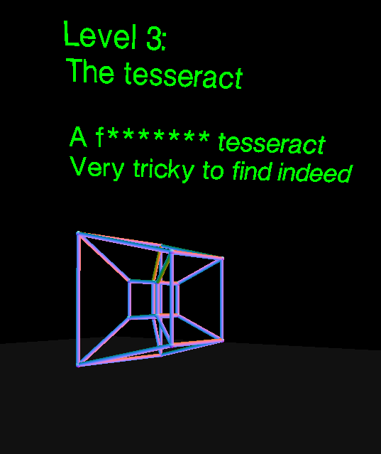

# The Museum of Impossible Artefacts

Hello! Welcome to my museum of impossible artefacts. The idea behind this piece was to use computer graphics to create items that would not be possible in everyday life. I got inspiration from the critical computing library piece, where I designed a library that was essentially a computer simulation. I wanted to portray knowledge in a cyberspace that would be completely separate from the real world, but as relatable as possible.

As succinctly as I could, I want the viewer to feel they are inside a separate realm; becoming completely engrossed in it. You are guided by some mysterious text that seem to come from something other-worldy. I wanted this guide to be friendly and relatable. I found it humorous to play with the idea that the 8 items in their collection could be copied and pasted into someone elses collection (like this transaction is normal in cyberspace), almost as if that's how this entity got them in the first place. In part, this is true as some of the fractal code was based on other work (although considerable effort was made to recreate from the down up). This pseudo fourth wall break develops a structure of this museum, much like it is just a directory of files/levels copied/found/created during the entity's travels.

### The levels:
#### Entrance
Welcome text over a noise floor.
#### The line that draws itself
This level features a 3D line that draws around you. The line is generated using THREE.JS' line geometry that faces a random direction for 200 iterations before redrawing itself in a new, random colour.

#### Water on the walls
Two big pools of water face each other over an artificial bed of sand. The water was created using vertex shaders and the ground using a fragment shader.

#### The tesseract
A 4D hypercube rotating about its axis. This was all done with THREE.JS geometry (no shaders).

#### Just a regular cube
A boring, floating cube. This level was added for humour purposes.

#### Three Red Blobs
Three red ethereal blobs flap around synchronously. I really enjoyed watching this vertex shader in action.

#### Game of life
Game of life in 3D. I adapted the 2D game of life to work in 3D with the following rules: If a cube has 2,3,4 neighbors it remains alive. If it is dead, and has exactly three neighbours it is resurrected. Else it is dead.

#### 3D fractal (mandelbulb)
A mandelbulb fractal created with raymarching (distance estimators).

#### 3D fractal (mandelbox)
A mandelbox fractal created with raymarching (distance estimators).

### Controls
Look around with the mouse. Press W to rise up a level. Press S to go down a level.

**NOTE TO START OPEN main.html**
